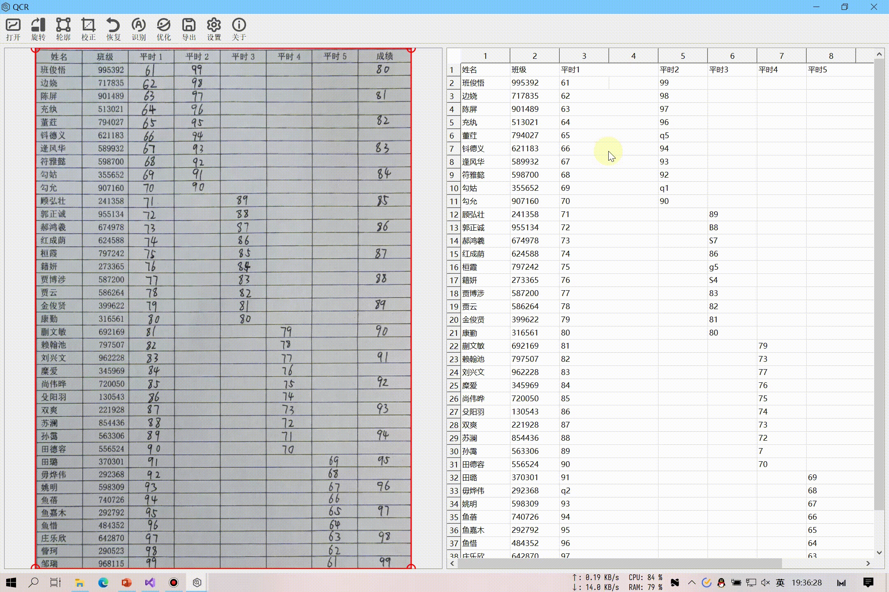

# TableQCR

## 简介

成绩单自动识别系统，实现了图像校正功能，接入腾讯和百度的OCR表格识别服务进行成绩单识别，对手写成绩进行本地的数字识别优化。

**开发环境：**

- Windows 10
- Visual Studio 2019

**依赖：**

- [Qt 5.15.2](https://www.qt.io/)
- [OpenCV](https://opencv.org/)
- [curl](https://github.com/curl/curl)
- [json](https://github.com/nlohmann/json)
- [boost](https://www.boost.org/)
- [frugally-deep](https://github.com/Dobiasd/frugally-deep)
- [spdlog](https://github.com/gabime/spdlog)

## 演示

**注：测试图像中的姓名班级均为随机生成！**

